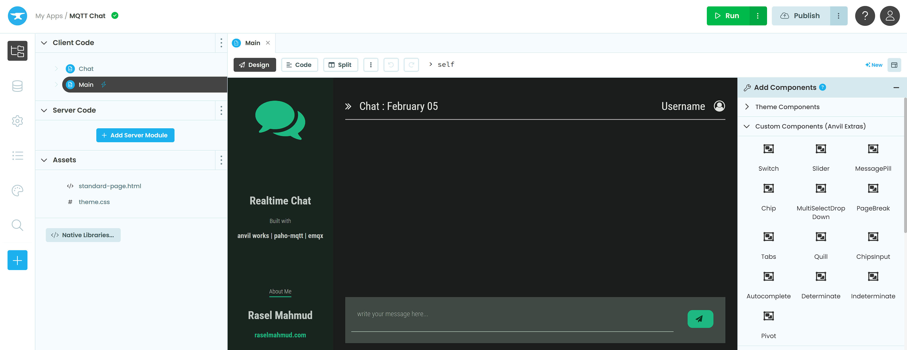
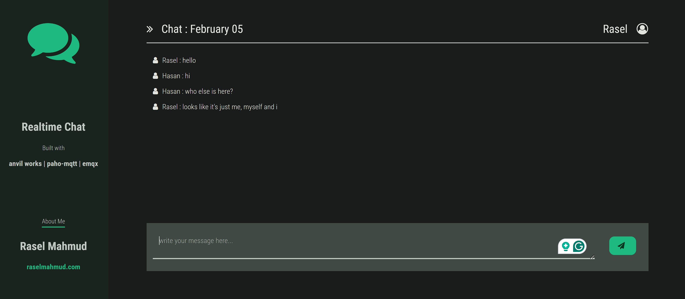

# How to Create a Real-Time Chat Application with Anvil, MQTT, and EMQX

## Introduction
- Brief overview of the project: creating a real-time chat application using Anvil, MQTT, and EMQX.
- Explanation of the technologies involved: Anvil for the front end, Paho MQTT JavaScript client library for MQTT communication, and EMQX MQTT broker for message exchange.

## Setting Up Anvil Environment
- Create a new Anvil app
- Design the chat interface using Anvil's visual editor.
- Add components such as text boxes, labels, and buttons for user interaction.

## Configuring MQTT Communication
- Import the necessary modules from Anvil and Paho MQTT library.
- Define functions to handle MQTT connection, message arrival, and disconnection.
- Set up a unique client ID and topic for the chat room.

## User Name and Initialization
- Prompt the user to enter their name using a text box.
- Store the user's name in local storage for future sessions.
- Initialize the MQTT client and connect to the EMQX MQTT broker.

## Sending Messages
- Implement the functionality to send messages when the user clicks the send button or presses enter.
- Check for errors such as missing user name or uninitialized MQTT client.
- Create and send MQTT messages with the user's name and message content.

## Receiving Messages
- Subscribe to the chat topic to receive messages from other users.
- Display received messages in the chat interface with the sender's name and message content.
- Scroll the chat window to show the latest messages automatically.

## Clean Up and Disconnect
- Disconnect the MQTT client when the chat window is closed or the user navigates away.
- Handle any connection errors or interruptions gracefully.
- Provide feedback to the user about the connection status and message sending process.

### Step-by-Step Guide

1. Start by creating a new Anvil app and designing the chat interface using Anvil's visual editor.  (I'm using Rally Theme). Add text boxes for entering messages, container and labels for displaying chat history, and a button for sending messages.




```javascript
// Add this in native libraries 
<script src="https://cdnjs.cloudflare.com/ajax/libs/paho-mqtt/1.0.1/mqttws31.js" type="text/javascript"></script>
```
2. Add anvil extras as dependency and Import the required modules from Anvil and Paho MQTT library in the Anvil code editor. Define functions for handling MQTT connection, message arrival, and disconnection.
```python
from datetime import datetime
from anvil.js.window import Paho
import uuid
import anvil.js
from anvil_extras.storage import local_storage
```
3. Generate an unique client ID and store it in local storage for future sessions.
```python
def get_client_id():
    if local_storage.get('client_id') is None:
        local_storage['client_id'] = f"{uuid.uuid4()}"
    return local_storage.get('client_id')
```
3. Prompt the user to enter their name using a text box when the chat window is opened. Store the user's name in local storage for future sessions.
```python
def get_user_name(self):
    while not self.user_name:
        tb = TextBox(placeholder='write your name')
        alert(tb, title="Enter your name:", buttons=["OK"])
        self.user_name = tb.text.strip()
        local_storage['user_name'] = self.user_name

```
4. Initialize the MQTT client with a unique client ID and connect to the EMQX MQTT broker using the `setup_mqtt()` function.
```python
def __init__(self, **properties):
    self.mqtt_client = None
    self.user_name   = local_storage.get('user_name')
    self.chat_id     = f'anvil-mqtt-chat-{datetime.now():%Y-%m-%d}'
    self.topic       = f"anvil/mqtt-chat/{self.chat_id}"
    self.init_components(**properties)
    self.setup_mqtt()
    self.label_chat.text = f'Chat : {datetime.now():%B %d}'
    
def setup_mqtt(self):
    self.mqtt_client = Paho.MQTT.Client("broker.emqx.io", 8084, get_client_id())
    
    self.mqtt_client.onConnectionLost = self.on_connection_lost
    self.mqtt_client.onMessageArrived = self.on_message_arrived
    
    self.mqtt_client.connect({
            'useSSL': True,
            'onSuccess': self.on_connection,
            'onFailure': self.on_failure
    })
```
5. Implement the functionality to send messages when the user clicks the send button or presses enter. Check for errors such as missing user name or uninitialized MQTT client before sending messages.
```python
def button_send_click(self, **event_args):
    msg_text = self.text_box_msg.text.strip()
    message = Paho.MQTT.Message(f"{self.user_name} : {msg_text}")
    message.destinationName = self.topic
    message.qos = 0
    message.retained = True
    self.mqtt_client.send(message)
    print(f"MESSAGE SENT : {msg_text}")
    self.text_box_msg.text = ''
    
```
6. Subscribe to the chat topic to receive messages from other users. Display received messages in the chat interface with the sender's name and message content.
```python
  def on_connection(self, response):
      print(f'CONNECTED : {response}')
      self.mqtt_client.subscribe(self.topic, 0)
  
  def on_message_arrived(self, message):
      print('MESSAGE ARRIVED: ', message.payloadString)
      msg = f'{message.payloadString}'
      self.card_chat.add_component(Label(text=msg, role='body', icon='fa:user'))
      l.scroll_into_view()
      self.text_box_msg.focus()
```
7. Scroll the chat window to show the latest messages automatically using the `scroll_into_view()` function.
8. Disconnect the MQTT client when the chat window is closed or the user navigates away using the `form_hide()` function. Handle any connection errors or interruptions gracefully.

**Final result should show something like this:**



By following these steps, you can create a real-time chat application with Anvil, MQTT, and EMQX that allows users to exchange messages seamlessly in a chat room environment.


|||
|---|---|
| Live Example | [mqttchat.anvil.app](https://mqttchat.anvil.app/) |
| Clone Link | [](https://anvil.works/build#clone:HZMPHZPRNBY4L5A3=5KYWFB5CI736ZBSTML4RYQWY)|
---


## What's Next
If you're a beginner in Anvil and trying to master the magic, you can do so in a fun way!  Try to add  the following features - 
- save the messages to a database.
- instead of just one global chat, build one-to-one chat for users 

