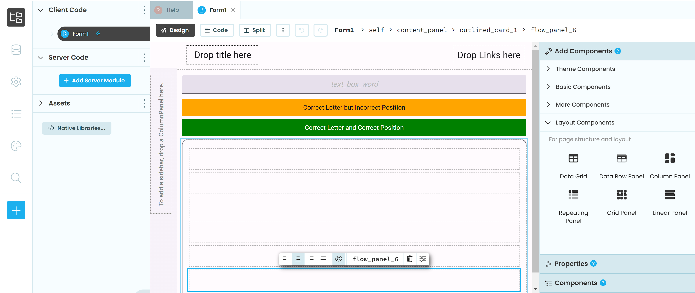
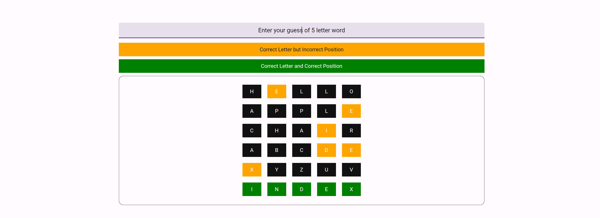

# How to Create a Word Guessing Game in Anvil with Only Python in Under 30 Lines

## Introduction
Hey there, Anvil enthusiasts! I'm Hasan Rasel. Today I bring to you a fun little exercise.
Whether you're just starting with Anvil or already got your hands dirty, the adrenaline is promised.
We're going to recreate the popular game **Wordle** in Anvil. Don't worry if you're not familiar with it; it's super simple:
- The app picks a random 5-letter word.
- You get 6 tries to guess it.
- After each guess, you'll get hints about how close you were to the secret word. We'll dive into that shortly.

## Steps

- [Build The UI](#lets-start-by-laying-out-the-ui)
- [Picking a Secret Word](#picking-a-secret-word)
- [Display Placeholders for Each Letter of the Word](#display-placeholders-for-each-letter-of-the-word)
- [Game Logic](#game-logic)
- [Resetting the Game](#resetting-the-game)

## Let's Build the UI
- Start by creating a new Anvil app.
- Drag and drop a TextBox and name it `self.text_box_word`, then center align it.
- Drag and drop a Label, set the text as "Correct Letter but Incorrect Position", and give it an orange background.
- Add another Label with the text "Correct Letter and Correct Position" and a green background.
- At this point, your UI should look something like this:


- Now, let's add an outlined card. This will serve as a container.
- Inside the outlined card, add 6 flow panels (one for each attempt).
- Center align the flow panels for a consistent look.
- Your UI should now resemble this:


- That's it for the UI, and it's hardly 5 minutes. Let's move on to the code!

## Picking a Secret Word
- Switch to Code View from Designer View.
- Create a ``word_list`` with your favorite 5-letter words or grab them all from the dictionary!
- To randomly select one from this list, we'll use the ``choice()`` function from the ``random`` module.
```python
from random import choice
word_list = ["apple", "about", "above", "abuse", "actor", "....."]
```

## Display Placeholders for Each Letter of the Word
- Loop through the 6 flow panels we added inside `outlined_card_1`.
- Add a Label for each letter inside each flow panel (5 labels in each).
- Let's make a function so that we can reuse it to reset the game too.
- Call the function in `init`.
```python
def __init__(self, **properties):
    self.init_components(**properties)
    self.reset_game()
    
def reset_game(self):
    self.secret_word = choice(word_list).upper()
    self.attempt_count = 0
    for fp in self.fp_list:
        fp.clear()
        for i in range(5):
            label = Label(text=" ", align='center', width=50, background='#111', foreground='#FFF')
            fp.add_component(label)
```

## Game Logic
- Add the `on_pressed_enter` event handler to our `text_box_word` to capture user input.
- Check if the entered word has exactly 5 letters.
- Compare each letter in the entered word with the secret word.
- Keep track of the correct letter count in each attempt.
- Provide hints to the player indicating correct and incorrect guesses.
- Update the attempt count and labels in the corresponding flow panel.
- If the player guesses all 5 letters correctly, show a winning notification.
- If the player exceeds 6 attempts, show a losing notification.
```python
def text_box_word_pressed_enter(self, **event_args):
    word = self.text_box_word.text.strip().upper()
    if len(word) != 5:
        return Notification("Word must be 5 letters!", title="Invalid word").show()
      
    correct_letter_count = 0
    self.attempt_count += 1
    fp_list = self.outlined_card_1.get_components()
    for i, letter in enumerate(word.upper()):
        label = fp_list[self.attempt_count-1].get_components()[i]
        label.text = letter
        if letter in self.secret_word:
            label.background = "orange"
            if letter == self.secret_word[i]:
                label.background = "green"
                correct_letter_count += 1
    
    if correct_letter_count == 5:
        Notification("You've guessed the correct word!", title="Congratulations!").show()
        sleep(5)
        self.reset_game()

    elif self.attempt_count >= len(fp_list):
        Notification(f"Correct word: {self.secret_word}",title="Game Over!").show()
        sleep(5)
        self.reset_game()
```
**When you run the app, it should look similar to this:**



## Resetting the Game
- After win or loss, call `reset_game()`, which essentially picks a new random word and clears the previous guesses and feedback.
- Maybe add a 5-second pause before resetting?

By following these steps, you can create a word-guessing game in Anvil where players can test their word-guessing skills and have fun trying to guess the secret word.

**With just a little tinkering, you could make it look like this:**


|||
|---|---|
| Live Example | [wordle.anvil.app](https://wordle.anvil.app/) |
| Clone Link | [](https://anvil.works/build#clone:RDCUJG3LIBL76SY5=BTSV66HN3OQFKJ32QHJLDUZN)|
---


## What's Next
If you're a beginner in Anvil and trying to master the magic, you can do so while having fun!
- Keep track of win/loss scores and save them to a database.
- You could add some animations from anvil-extras
- Add functionalities to make it multiplayer; instead of picking a random word, accept a challenge from another user.
